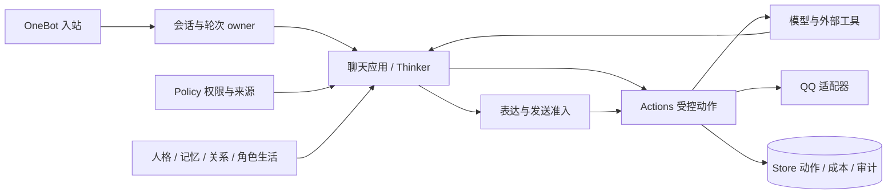

# 架构

原生 Python 单体，按实际状态 owner 与生命周期组织核心—服务—应用三层。层次由依赖合同表达，不机械建立三套目录或万能上下文。

## 三层职责

| 层 | 负责 | 边界 |
| --- | --- | --- |
| 核心 | 会话、轮次、任务身份，版本失效、取消和提交合同 | 不引用具体模型、HTTP 或业务算法 |
| 服务 | 模型、存储、权限、工具、受控动作、调度与业务状态 | 不能自行扩大权限或建立另一个发送出口 |
| 应用 | 对话目的、Thinker 策略、内容组织、主动联系、管理交互 | 通过现有服务消费状态，不另建配置或任务体系 |

装配根显式创建并关闭客户端、Store 与受管任务。一个运行实例使用独立目录、凭据与数据库；不允许多个应用执行者共享同一实例的副作用队列。

## 对话数据流

模型接收文本本身也属于外部数据动作，需要对应授权。纯本地时间工具不人为增加外部发送记录，仍检查工具能力。图中业务状态各有 owner，不存在总管所有状态的情绪中心或第二事件总线。

## 关键状态归属

| 职责 | owner / 实现位置（新版源码） |
| --- | --- |
| 装配和关闭 | bootstrap |
| 轮次与提交、会话排序 | runtime / scheduling |
| 回复与上下文消费 | conversation |
| 可信主体、精确范围、撤权版本 | policy |
| 动作意图、执行、真实回执、未知结果 | actions |
| QQ 实际写准入、限频、停发与结算 | qq_delivery |
| 日常配置保存与运行快照 | settings / config |
| 单库事务和业务记录 | store，表的逻辑 owner 明确 |
| 记忆、关系、情绪、故事与事项 | 各业务 owner，按用途投影到当前轮次 |

这些是职责索引，对应公开 `src/omubot_new/` 中的新版文件。内部通过明确构造参数与窄接口连接，不使用全局 service locator。

## 为什么这样拆

能追踪一条输入如何变成回复、用到了哪些有效状态，以及外部动作究竟到了哪一步。撤权、轮次失效或来源到期后，迟到结果不得提交；已经可能发出的动作保留事实，不能当作取消成功后重新发送。

这支持维护与核验，不等于已证明性能或聊天质量优于旧版。真实状态见 [Status](Status.md)。
